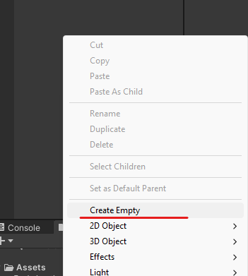

# 16. Instanciar enemigos

Vamos a crear un Spawn de zombies para eso el zombie tiene que ser un Prefab, para hacerlo lo arrastramos a la carpeta Prefab y ya.

<p align="center">
  
</p>

Creamos un elemento vacío que llamaremos EnemySpawn 

|  |  |
| ------------- | ------------- |

Creamos un C# que se llamara SpawnController

## Código

```csharp
public GameObject enemyPrefab;//elemento donde guardaremos el zombie

void Start()
{
  StartCoroutine("SpawnEnemy");//llamamos a la funcion para que se ejecute
}

IEnumerator SpawnEnemy()//funcion que genera pausas en su ejecucion
{
  yield return new WaitForSeconds(2f);//pausa de 2 segunds
  while(true)
  {
    Instantiate(enemyPrefab, transform.position, Quaternion.identity);//generamos el zombie
    yield return new WaitForSeconds(8f);//pausa de 8 segundos para que se vuelva a generar un zombie
  }
}
```

## Zombie

Al prefab del zombie le tendremos que añadir un Rigidbody 2D y un Capsule Collider 2D

<p align="center">
  
</p>

## Unity

Por ultimo al elemento EnemySpawn le añadimos el Script y le indicamos cual sera el elemento que generara.

<p align="center">
  
</p>