# 18. Matar enemigo

Añadimos la animación al personaje esta animación se reproducirá cuando este el personaje sin moverse

<p align="center">
  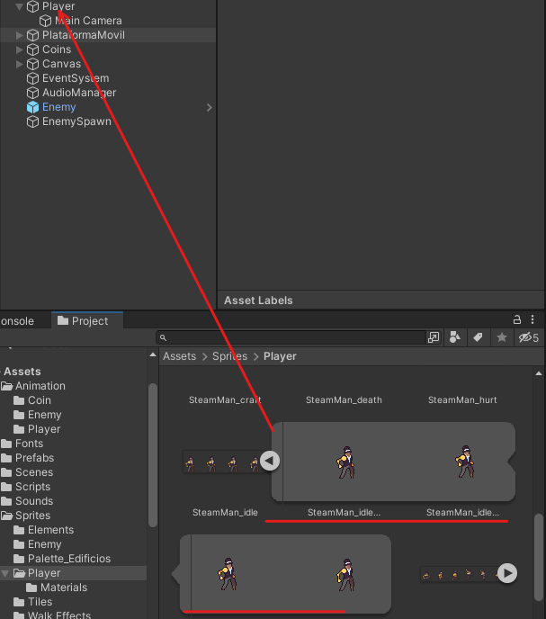
</p>

Ahora le añadimos la animación de ataque de la misma forma.

<p align="center">
  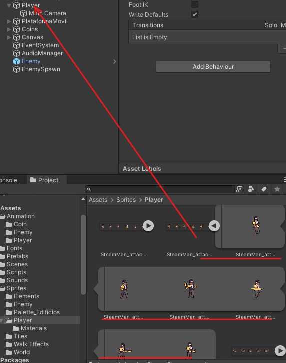
</p>

Cuando la añadamos nos aparecerá así lo que tenemos que hacer es que la animación de idle sea la principal y pueda cambiar a las demás.

<p align="center">
  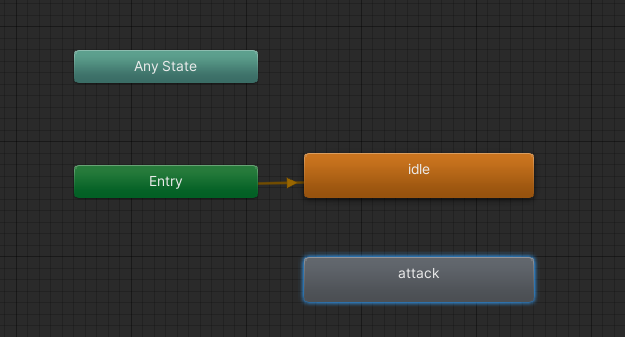
</p>

Le indicamos que vamos a cambiar a la animación de atacar.

<p align="center">
  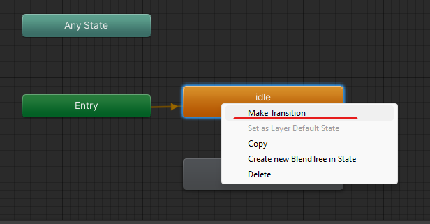
</p>

Esto solo se producirá cuando se cumpla una condición para eso tendremos que ir a Parametres y añadir un Trigger.

<p align="center">
  
</p>

**Has Exit Time** → Es para terminar la animación de idle para cambiar a la otra

**Conditions** → Le daremos al + para añadir una condición a la ejecución de la animación mas tarde la accionaremos en código 

<p align="center">
  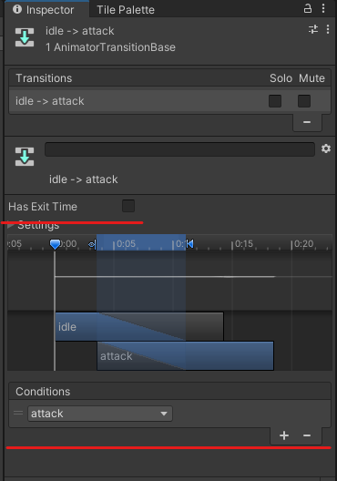
</p>

Además tendremos que añadir una transición para volver al estado original

<p align="center">
  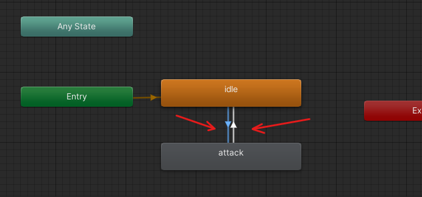
</p>

## Ataque

Al player le añadimos un objeto vacío

<p align="center">
  
</p>

Le añadimos un box Collider que se ajuste a la animación de ataque

<p align="center">
  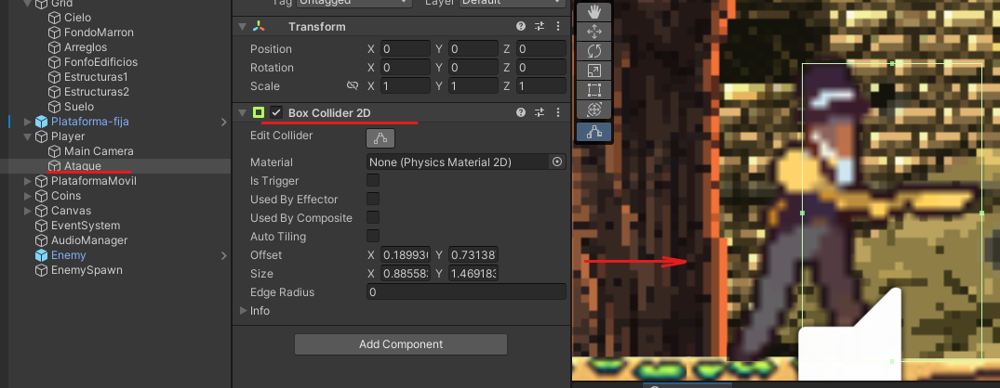
</p>

Como no podemos tener 2 collider que se estén pisando tenemos que hacerlo Trigger

<p align="center">
  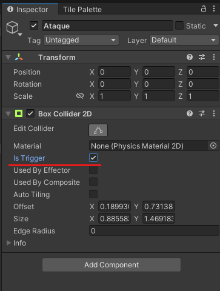
</p>

Además de eso, si lo dejáramos así estaría activado en todo momento por eso lo tenemos que desactivar.

<p align="center">
  
</p>

Y ahora tendremos que activarlo en la animación para eso le damos al botón de grabar.

<p align="center">
  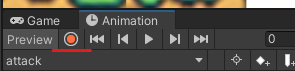
</p>

Le marcamos la opción para activar el collider en todo momento menos en el final.

<p align="center">
  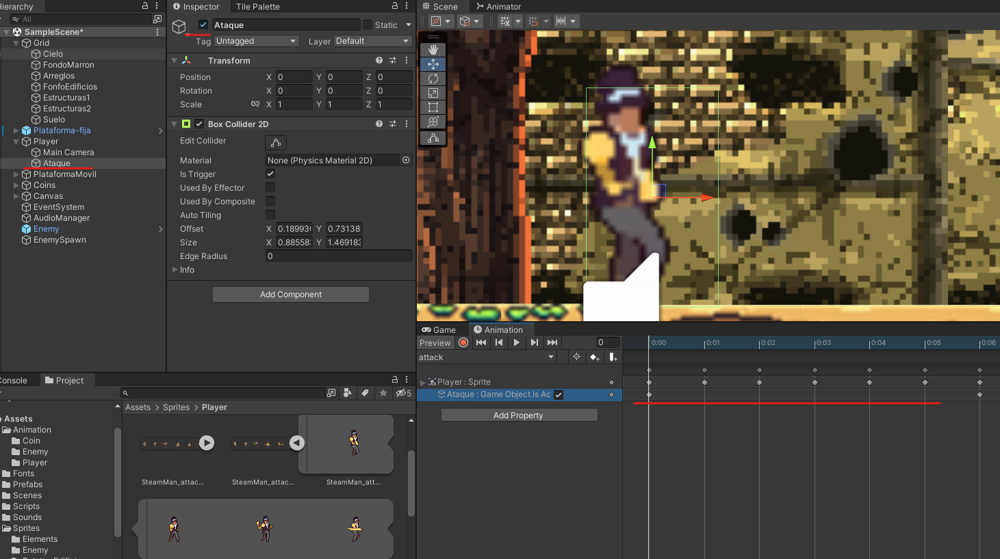
</p>

Que le quitaremos lo desactivaremos.

<p align="center">
  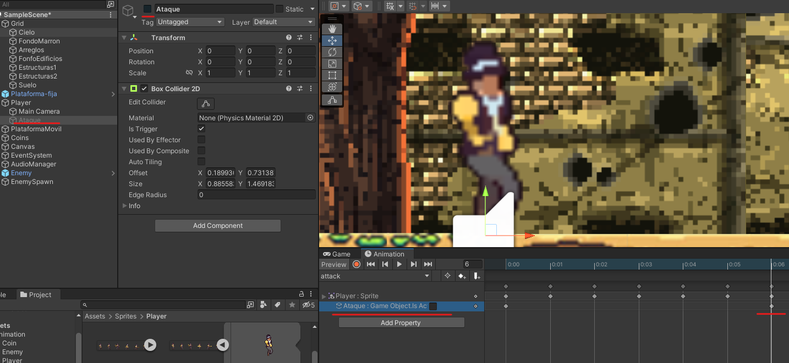
</p>

Por ultimo dejaremos de grabar

## Código

### AttackController

```csharp
private void OnTriggerEnter2D(Collider2D collision)
{
  if (collision.tag == "Enemy")
  {
    Destroy(collision.gameObject);
  }
}
```

### PlayerController

```csharp
private Animator animatorPlayer;

void Start()
{
  animatorPlayer = GetComponent<Animator>();
}

void Update()
{
  if (Input.GetKeyDown(KeyCode.F))//accion de atacar
  {
    animatorPlayer.SetTrigger("attack");
  }
}
```

</br>

<p align="center">
  
</p>