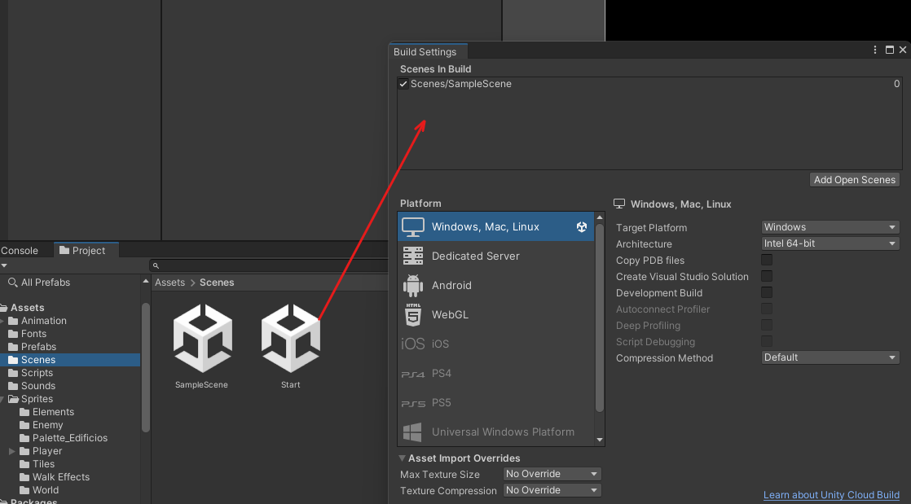
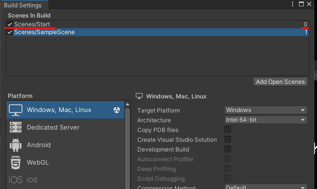

# 20. Pantalla inicio

Para crear una menú tendremos que crearnos una escena

<p align="center">
  
</p>

Acedemos a ella haciendo doble click sobre la nueva escena y creamos un Canvas con su panel texto botones..

<p align="center">
  
</p>

## Código

```csharp
public void StartGame()
{
  SceneManager.LoadScene("SampleScene");
}

public void ExitGame()
{
  Application.Quit();
}
```

Al panel le damos el Script

<p align="center">
  
</p>

Al botonStart y botonExit le añadimos al evento onclick el panel y le concretamos que método tendrá que ejecutar

<p align="center">
  
</p>

Ahora tenemos que indicar con que escena tiene que arrancar el programa

<p align="center">
  
</p>

Añadimos la escena

<p align="center">
  
</p>

Y la colocamos por encima haciendo que sea la 0

<p align="center">
  
</p>